 

Ghala's Logbook: MLab (ICTP)   
-
---
> **This project is being conducted as part of my summer research program at the [ICTP](https://www.ictp.it) International Centre for Theoretical Physics in
the Multidisciplinary Lab (MLAB)
in Trieste, Italy, under the supervision of [Maynor Ballina](https://github.com/Mballina42) and [Romina Molina](https://github.com/RomiSolMolina).
Sponsored by [KAUST](https://www.kaust.edu.sa/en/) Academy.** 

>This project focuses on the implementation and optimization of Sparse Matrix-Vector Multiplication (SpMV) on FPGAs using 
High-Level Synthesis (HLS). The goal is to evaluate different sparse matrix compression formats, analyze their performance in 
software and hardware environments, and implement an efficient SpMV accelerator targeting FPGA platforms.

---
**In this Logbook:**

### [Click for Full Tutorial: How to Deploy any SpMV Method on FPGA](#full-tutorial-how-to-deploy-any-spmv-method-on-fpga)

- [Week 1](#Week-1)
- [Week 2](#Week-2)
- [Week 3](#Week-3)
  - [High-Level Synthesis Basics](#High-Level-Synthesis-Basics)
- [Week 4](#Week-4)
  - [ML Exercise](#Gamma-Neutron-discrimination-based-on-ML)
  - [Sparse Matrix Vector Multiplication (SpMV)](#Sparse-Matrix-Vector-Multiplication)
    - [SpMV_Algorithms.py](GhalaMore%2FSpMV_Algorithms.py)
    - [Compare Results](#compare-methods-click-for-full-code)
- [Week 5](#Week-5)
  - [SpMV in the Cluster](#results-of-running-spmv-in-the-cluster)
  - [Parallel Computing of SpMV Using n Cores](#results-parallel-computing)
    - [Access to Full Code in Jupyter Notebook](GhalaMore%2FSparseMatrixnCores.ipynb)
  - [CSR HLS Implementation](#compression-sparse-row-csr-spmv-hls-implementation)
    - [CSR HLS Code Explained](#compression-sparse-row-csr-hls-code-explanation)
- [Week 6](#Week-6)
- [Week 7](#Week-7)
  - [2-Week Problem Solved](#-2-weeks-long-issue-with-spmv-implementation)
  - [Final SpMV Block Design](#spmv-block-design)
  - [Full Tutorial: Implementing SpMV on FPGA using HLS](#full-tutorial-how-to-deploy-any-spmv-method-on-fpga)
    - [Flowchart](#-flowchart)
      - [Phase 1: Validate Format](#-phase-1-validate-format-)
      - [Phase 2: Performance on FPGA](#-phase-2-performance-on-fpga)
      - [Phase 3: HLS Development](#-phase-3-hls-development)
      - [Phase 4: Vivado](#-phase-4-vivado)
      - [Phase 5: Host FPGA Interface](#-phase-5-host-fpga-interface)
- [Week 8](#Week-8)
  - [Full Example: Implement SpMV using ELLPACK in HLS](#example-implement-spmv-using-ellpack-in-hls)
  - [Scale Design to Larger Matrices: Flow-Control Technique](#-scale-design-to-larger-matrices)
  - [Comparing 3 Different Compression Formats Used for SpMV (CSR, ELL, COO)](#comparing-3-different-compression-formats-used-for-spmv-csr-ell-coo)
    - [4x4 Matrix](#algorithms-tested-on-4x4-matrix)
    - [256x256 Matrix](#algorithms-tested-on-256x256-matrix)
    - [512x512 Matrix](#algorithms-tested-on-512x512-matrix)
  - [Distributed Computing SpMV using CSR, ELL, and COO](#distributed-computing-spmv-using-csr-ell-and-coo)

***

## Week 8

### August 4, 2025
- Completed [Full Example: Implement SpMV using ELLPACK in HLS](#example-implement-spmv-using-ellpack-in-hls)
- Worked on debugging implementation of [ELL](#4-ellpack-ell-format)

### August 5, 2025
- Implemented SpMV using [(COO)rdinate format](#3-coordinate-coo-formate).
- Scale all methods up using slightly different connections, see explanation here: [Scale Design to Larger Matrices](#-scale-design-to-larger-matrices)
- Started testing ELL on a 256x256 matrix.

### August 6, 2025
- ELL doesn't run on 256, not enough cells
- Started comparing algorithms and writing a new section: [CSR, ELL, COO Implementation Comparison](#comparing-3-different-compression-formats-used-for-spmv-csr-ell-coo)

### August 7, 2025
- Increased number of data in until 512x512 matrix (this is the max).
- Started with distributed programming CSR, ELL, COO

### August 8, 2025
- Worked on distirbuted computing of 3 algorithms
- Started a new section in the logbook: [Distributed Computing SpMV using CSR, ELL, and COO](#distributed-computing-spmv-using-csr-ell-and-coo)

## Week 7

### July 29, 2025
### üî∏ 2 Weeks Long Issue with SpMV Implementation:
- Current issue: the result of spmv on the server is `[None]`
- Added the line: `#pragma HLS INTERFACE mode=ap_ctrl_hs port=return` to the hls code; this line generates a hardware control interface
using handshake protocol (hs). ap_ctrl_hs includes: ap_start, ap_done, ap_ready, ap_idle. The line makes this function behave like a block that I 
can start and check if it's done from software. In the software (Jupyter Notebook) I control this using the line `cb.write_reg(0, 1)` which starts 
the IP.
- **Small issue causing big trouble:** I am editing reg1 instead of reg3 that controls ap_ready.
- **Current Output:** the output on the server alternates between: `[None]` and `[28, 0, 6, 28]`.
  - **Why?** In my design I am using AXI stream for input/output and controlling it using a start pulse (ap_start) from the Comblock. I am only
  using FIFOs and not using RAM which wouldn't cause this problem. When using the pulsing sometimes the pulse reaches the IP before the FIFO is full so
  then the IP begins computation with partial or shifted data. Therefore, the data either computes garbage `[None]` or reads the wrong values in so does the computation
  wrong`[28, 0, 6, 28]`. This is called **race condition** where the system's behavior is dependent on the sequence or timing of other uncontrollable events (in this case the pulsing).
    - **How to fix?** Experiment with different directives to separate data-loading and computation.
    - **Debugging Process:** read values of x[], values[] arrays in in_fifo and write them in out_fifo and observe what is happening in the server:
      - x[]: output alternates between `[None]` and `[4, 5, 2, 3]`
      - values[]: output alternates between `[None]` and `[3, 3, 5, 9, 2, 3, 1, 4, 6]`
    - **Observation:** There is a shift happening when reading in the values.
  - **Upon Further Inspection** The lines `#pragma HLS PIPELINE off` stalls the hardware clock by not moving to the next iteration until the previous one is done and doesn't handle streaming 
  delays or FIFOs which causes the shift and reads whatever data is next even if FIFO is not ready yet which is what was causing the race condition. By deleting `#pragma HLS PIPELINE off` it 
  allows to start a new loop iteration each clock cycle as long as data is ready. It uses The FIFOs' TREADY and TVALID instead of directly reading whatever is next. Each `in_fifo.read()` waits 
  until the FIFO has valid data. 
- **Output is now correct:** `[11, 37, 15, 32]` 

# SpMV Block Design

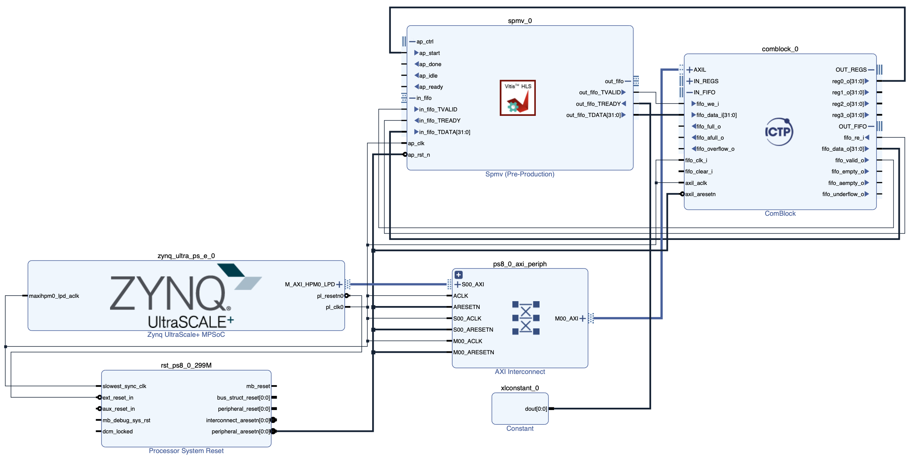

>Block design representing the Sparse Matrix-Vector Multiplication (SpMV) hardware implemented on a Zynq
UltraScale+MPSoC platform. The design combines SpMV IP (developed with HLS in earlier steps), Zynq processing system, and the programmable logic.

üî∏ **Programmable Logic in this design includes:**
- SpMV IP
- Comblock 
- Interconnect logic (AXI, FIFOs, resets)
- All the routing, control, and timing logic

üî∏ **Components:**
- The PS (zynq_ulta_ps_e_0) transfers data and control signals to/from PL via AXI Interconnet. Also provides clocks and resets.
- The IP core (spmv_0) performs [SpMV](#sparse-matrix-vector-multiplication) using [CSR](#1-compressed-sparse-row-csr). Also receives inputs and sends back results.
- Comblock (communication block) interface allows data transfer between PS and IP core.
- AXI interconnect connects SpMV and Comblock to PS.
- Processor System Reset (rst_ps8_0_22M) generates resets.
- "xlconstant_0" = 1 provides constant signal to out_fifo_TREADY to signal always ready

### July 30, 2025
- Started writing a tutorial on [how to deploy SpMV on FPGA](#full-tutorial-how-to-deploy-any-spmv-method-on-fpga).

### July 31, 2025
- Finished writing a tutorial on [how to deploy SpMV on FPGA](#full-tutorial-how-to-deploy-any-spmv-method-on-fpga).

### August 1, 2025
- Started with implementing SpMV using ELLPACK compression format in HLS.
- Implemented ELLPACK on Vitis HLS, Created Block Design, started with hosting FPGA interface
- Started writing a new section: [Implement SpMV using ELLPACK in HLS](#example-implement-spmv-using-ellpack-in-hls)

## Week 6

### July 21, 2025
- Presented about our project and the progress we've made to Mr. Marco Zennaro.

### July 22, 2025
- Presented about our project and the progress to our project advisors.
- Concatenated all inputs into one input in HLS; to have less wiring.
- Worked on an error in HLS.

### July 23, 2025
- Solved HLS error by using another approach for streaming data in HLS
- Further optimized footprint on the new concatenated code.
- Integrated the IP into Vivado Block Design along with the PS, Comblock, and AXI Interconnect. 
- Tested FPGA output communication via the cluster server on Jupyter.
- Worked on an error in HLS. 

### July 24, 2025
- Solved hls error; one loop was using .read() twice and printing form one of them which explains why its skipping some numbers when printing.
- Regenerated block design and retested FPGA output on the cluster. [Current Block Design](#spmv-block-design)
- **CHANGES on Block Design & HLS:**
  - comblock fifo_re_i connected to reg3_o, previously connected to spmv in fifo_TREADY
- **PROBLEMS Faced testing SpMV in Jupyter Notebook:**
  - Generates _[None]_
  - Generates _[[0,0,0,0]]_
  - Comblock doesn't show up when I import hardware -> _firmware: SpMV comblock: []_

## Week 5

### July 14, 2025
 - Presented a presentation about [SpmV](#sparse-matrix-vector-multiplication).
 - Tested the algorithms in the cluster. (Matrices: 4x4, 10x10, 100x100).
 - Compared execution time of the algorithms in the cluster and in local laptop. ([See Below](#results-of-running-spmv-in-the-cluster))
## Results of Running SpMV in the cluster
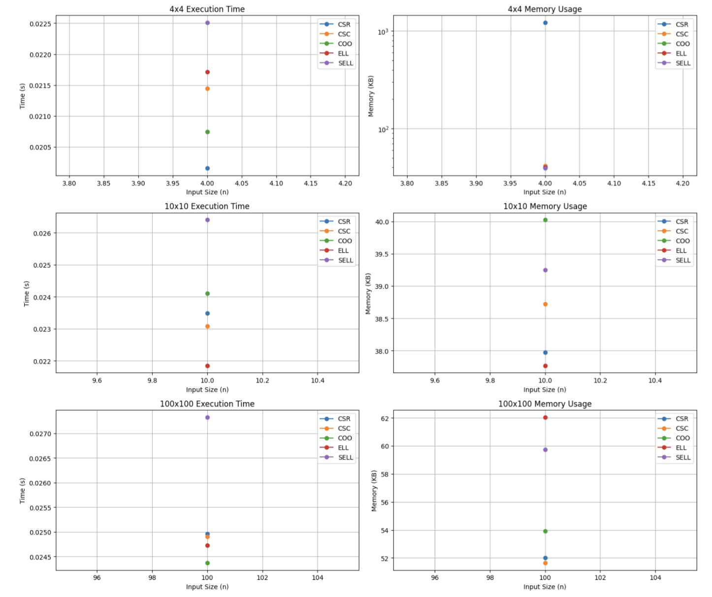 

üî∏ **Data:**

    
Detailed results for the time and memory

CSR | Input: 4 | Time: 0.020155s | Memory: 1219.56 KB

CSC | Input: 4 | Time: 0.021446s | Memory: 41.25 KB

COO | Input: 4 | Time: 0.020747s | Memory: 39.50 KB

ELL | Input: 4 | Time: 0.021715s | Memory: 40.09 KB

SELL | Input: 4 | Time: 0.022510s | Memory: 39.16 KB

CSR | Input: 10 | Time: 0.023481s | Memory: 37.97 KB

CSC | Input: 10 | Time: 0.023077s | Memory: 38.72 KB

COO | Input: 10 | Time: 0.024107s | Memory: 40.02 KB

ELL | Input: 10 | Time: 0.021850s | Memory: 37.77 KB

SELL | Input: 10 | Time: 0.026403s | Memory: 39.25 KB

CSR | Input: 100 | Time: 0.024961s | Memory: 52.01 KB

CSC | Input: 100 | Time: 0.024910s | Memory: 51.66 KB

COO | Input: 100 | Time: 0.024375s | Memory: 53.91 KB

ELL | Input: 100 | Time: 0.024731s | Memory: 62.04 KB

SELL | Input: 100 | Time: 0.027324s | Memory: 59.74 KB

üî∏ **Analysis:**

The algorithms run slower on the server than on local laptop. Memory consumption was also way higher, especially for the
CSR when tested on a 4x4 matrix. When tested on a 100x100 matrix, SELL and ELL show higher time due to padding. Memory 
consumption increases for ELL and SELL. On the local laptop COO showed the least execution time for 4x4 and 10x10 matrices 
but in the cluster this is not the case, but it's still lower than other formats.

* For smaller matrices, COO and CSR performed the best.
* For larger matrices, CSR remains efficient. SELL and ELL perform good as well.
* COO is good even at 100x100 but would not scale well in larger matrices.
* CSC performs similar to CSR but not better.

### July 15, 2025
- Implemented parallel computing using multiple cores to perform [SpMV](#sparse-matrix-vector-multiplication)
- New performance measurements: 
  - Transmission time
  - Computation time
- Tested the 5 algorithms on 10x10, 100x100, 1000x1000. ([Read More](#results-parallel-computing))

### July 16, 2025
- Wrote an analysis for the results from yesterday. ([Read More](#results-parallel-computing))
- New concepts: Direct View vs. Load Balancing, Hardware specific optimization, profiling different formats,
parallel performance.

## Results Parallel Computing

    
Detailed Results of Using 1 CPU Core

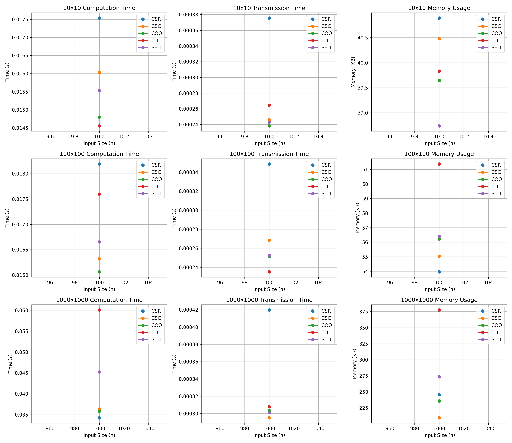

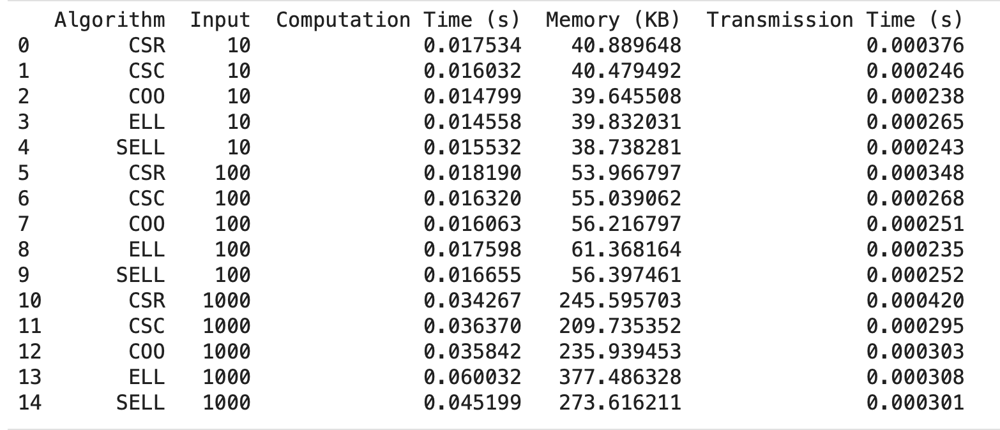

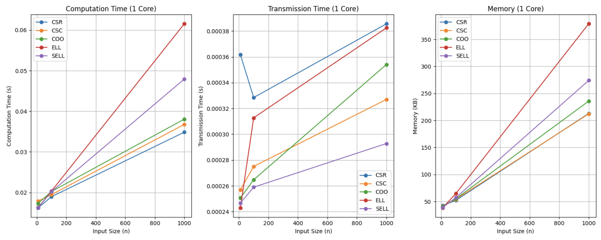

    
Detailed Results of Using 2 CPU Core

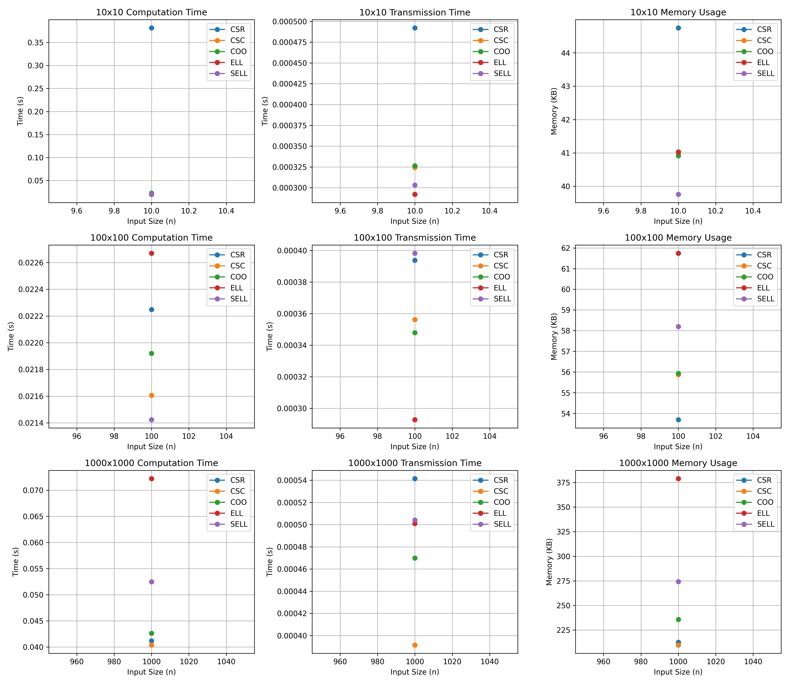

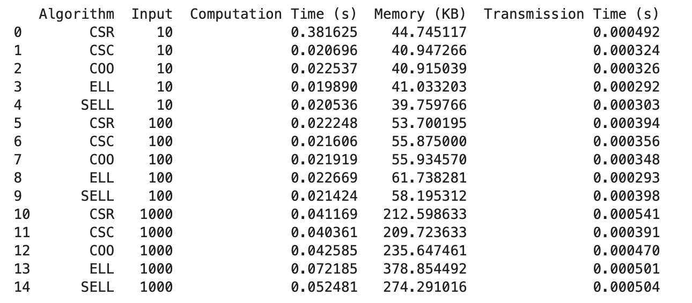

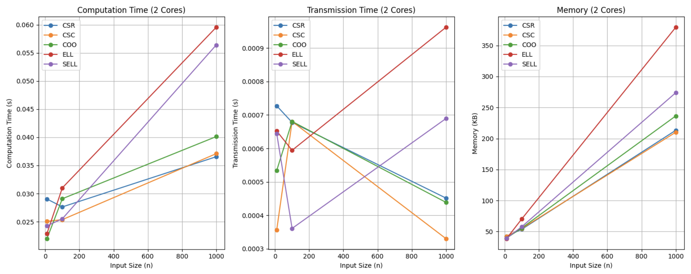

    
Detailed Results of Using 3 CPU Core

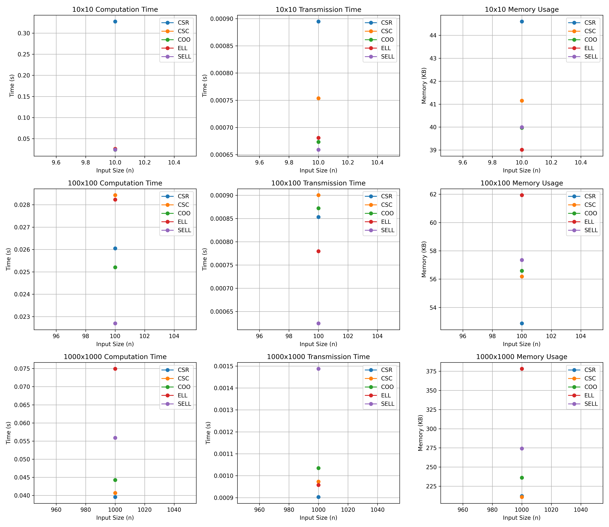

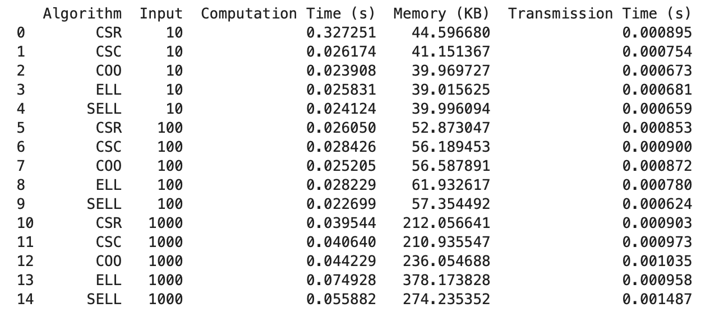

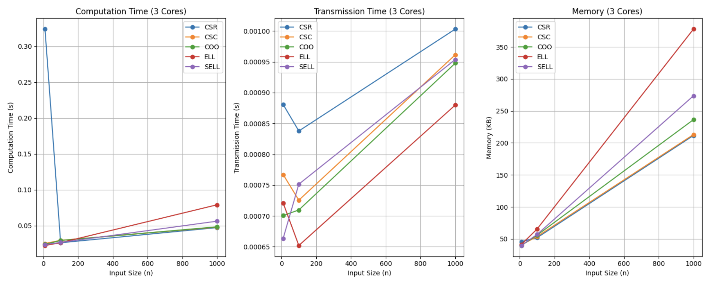

    
Detailed Results of Using 4 CPU Core

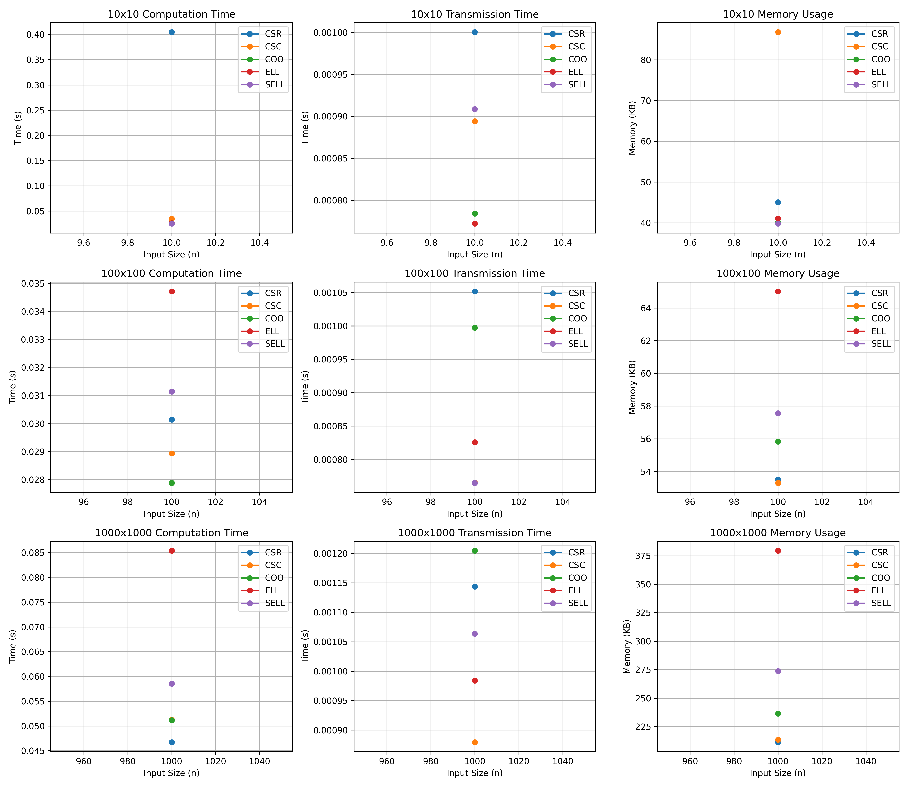

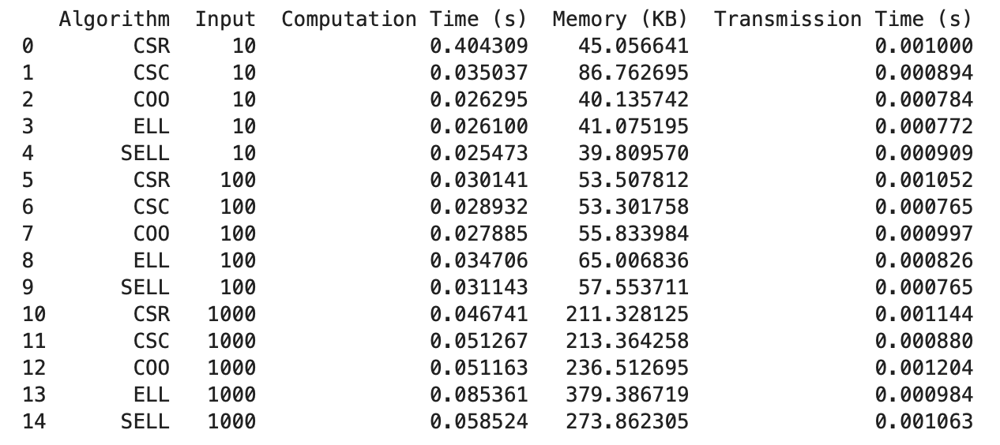

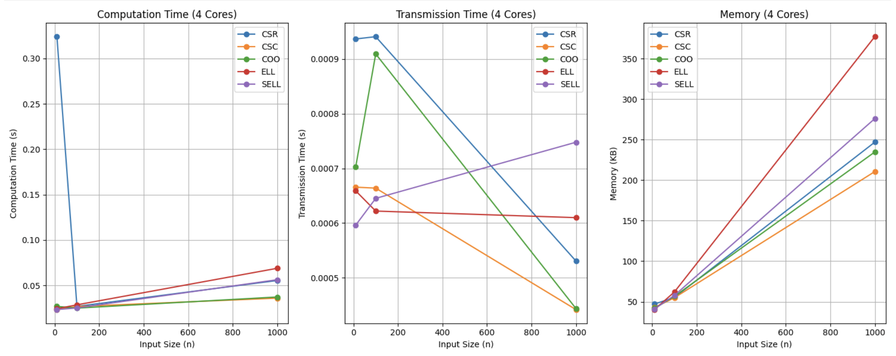

### üî∏ Analyze Results ([Access the Jupyter Notebook](GhalaMore%2FSparseMatrixnCores.ipynb)):

All formats slightly increase in computation time and memory usage when increasing the number of cores being used. By using parallelism, 
our goal is to decrease the computation time by distributing the tasks over multiple cores in the CPU; however, due to the codependency in
SpMV, parallelism would contribute in increasing the computation time. 

Testing the algorithms on a 1000x1000 matrix made the differences between formats clearer:
  
### 1000x1000 Matrix 

  | Number of Cores | Least Computation Time | Least Memory | Least Transmission Time |
  |-----------------|------------------------|--------------|-------------------------|
  | 1               | CSR                    | CSC          | CSC                     | 
  | 2               | CSC                    | CSC          | CSC                     | 
  | 3               | CSR                    | CSC          | CSR                     |
  | 4               | CSR                    | CSR          | CSC                     |

üî∏ **Observations:**
- For size 1000x1000 matrices, **_CSC usually performs the best_** no matter the number of cores used. CSR is also a competitive format.
- **_ELL takes up the most memory_**, this is due to it adding paddings to rows.
- Similar to ELL, **_SELL is the second format with the most memory usage_**. It makes sense because SELL divides the matrix 
into chunks making the padding of rows more variant.
- **_ELL perform the worst_** because it is a format that is made to be good in GPU not CPU, similar to SELL. 
 

### July 17, 2025

- Decided which SpMV method is best to use in HLS; [CSR](#1-compressed-sparse-row-csr)
- Task: Using algorithmic high-level synthesis (HLS) to build SpMV using the best performing compression format from [prior results](#results-parallel-computing).
- Goal: Use directives for:
  - Footprint optimization
  - Timing optimization

### July 18, 2025
- Completed CSR HLS Implementation and documented important information. ([See Below](#compression-sparse-row-csr-spmv-hls-implementation))
- Wrote code explanation for [csr in hls implementation](#compression-sparse-row-csr-hls-code-explanation)

## Compression Sparse Row (CSR) SpMV HLS Implementation

1) Standard Compression Sparse Row (CSR) HLS Implementation:

**Estimated time: 2.185 ns**

**Period = 3**

  | Loop   | Directives   | DSP | FF  | LUT |
  |--------|--------------|-----|-----|-----|
  | Module |              | 5   | 659 | 569 |
  | L1     | Pipeline off |     |     |     |
  | L2     | Pipeline off |     |     |     |

2) CSR HLS Implementation with **Footprint Optimization**

SAME AS THE STANDARD

**Estimated time: 2.185 ns**

**Period = 3**

  | Loop   | Directives   | DSP | FF  | LUT |
  |--------|--------------|-----|-----|-----|
  | Module |              | 5   | 659 | 569 |
  | L1     | Pipeline off |     |     |     |
  | L2     | Pipeline off |     |     |     |

3) CSR HLS Implementation with **Time Optimization**

**Estimated time: 2.185 ns** 

**Period = 3**

  | Loop   | Directives                       | DSP | FF   | LUT |
  |--------|----------------------------------|-----|------|-----|
  | Module |                                  | 3   | 1167 | 865 |
  | L1     | Pipeline                         |     |      |     |
  | L2     | Pipeline off & Unroll factor = 8 |     |      |     |

4) Book Instructs to use:

VIOLATION: Unable to enforce a carried dependence constraint

**Period = 3**

**Estimated time: 2.185 ns**

  | Loop   | Directives                      | DSP | FF   | LUT  |
  |--------|---------------------------------|-----|------|------|
  | Module |                                 | 3   | 2598 | 2896 |
  | L1     |                                 |     |      |      |
  | L2     | Pipeline on & Unroll factor = 8 |     |      |      |

The book uses an earlier version of Vitis HLS. When applying this on Vitis 2022, it results in a dependency violation 
which is likely due to the 2022 version being more optimized and works a little differently. 

üî∏ **Observations:**

- When using hls pipeline in L2, it results in a violation and instructs to use unroll directive (dependency).
- When using a clock period of less than 3, it results in a timing violation.
- Unroll results in an error if used without specifying its factor. This is because the number of iterations depend on rowPtr[i+1] - rowPtr[i]
and varies per row (dynamic, not in compile time).
- Unroll is not going to work if the factor is >= 4 because the input matrix requires more iterations (Trip Count = 4)
- In L2, when using both pipeline and unroll, it results in violation (dependency).
- Array Partitioning has no effect on the time and only increases the resources.

## Compression Sparse Row (CSR) HLS Code Explanation

###### Source File:

    #include ”spmv.h”

    void spmv(int rowPtr[NUM ROWS+1], int columnIndex[NNZ],
              DTYPE values[NNZ], DTYPE y[SIZE], DTYPE x[SIZE])
    {
        L1: for (int i = 0; i < NUM ROWS; i++) {
            DTYPE y0 = 0;
            L2: for (int k = rowPtr[i]; k < rowPtr[i+1]; k++) {
    
                y0 += values[k] * x[columnIndex[k]];
            }
            y[i] = y0;
        }
    }

The function spmv takes in 3 input vectors (rowPtr, columnIndex, values, x) and 1 output vector(y). It uses nested loops, the first for loop
loops through rowPtr. The second loops through the nnz values in one row by taking the difference in two indices from rowPtr since rowPtr indicates
where does a row starts and end in values vector. Then the function does dot multiplication for each nnz value in a row. It multiplies the nnz value by
the matching value in the input vector (x[columnIndex[k]]) then adds the values to y0. y0 is then appended into the output vector.

###### Testbench File:

    #include ”spmv.h”
    #include <stdio.h>

    void matrixvector(DTYPE A[SIZE][SIZE], DTYPE * y, DTYPE * x)
    {
        for (int i = 0; i < SIZE; i++) {
            DTYPE y0 = 0;
            for (int j = 0; j < SIZE; j++)
                y0 += A[i][j] * x[j];
            y[i] = y0;
        }
    }
    int main(){
        int fail = 0;
        DTYPE M[SIZE][SIZE] = {{3,4,0,0},{0,5,9,0},{2,0,3,1},{0,4,0,6}};
        DTYPE x[SIZE] = {1,2,3,4};
        DTYPE y_sw[SIZE];
        DTYPE values[] = {3,4,5,9,2,3,1,4,6};
        int columnIndex[] = {0,1,1,2,0,2,3,1,3};
        int rowPtr[] = {0,2,4,7,9};
        DTYPE y[SIZE];
        spmv(rowPtr, columnIndex, values, y, x);
        matrixvector(M, y_sw, x);
        for(int i = 0; i < SIZE; i++)
            if(y sw[i] != y[i])
                fail = 1;
        if(fail == 1)
            printf(”FAILED\n”);
        else
            printf(”PASS\n”);
        return fail;
    }

In main, 7 different vectors are initiated, 5 of those vectors are passed to _spmv_ function in the source file, and 3 are passed
to the _matrixvector_ function. _spmv_ is taking:
- columnIndex: vector holds column indices for each nnz value.
- values: vector hold nnz values of the matrix
- rowPtr: vector holds the index in values[] at which each row starts.
- x: dense input vector that is getting multiplied by the matrix.
- y: dense output vector.

_spmv_ does the multiplication of the matrix and the input vector in the source file.

_matrixvector_ takes in:

- M: vector of vectors, each vector represents a row in the matrix.
- y_sw: output vector.
- x: input vector.

_matrixvector_ computes the sparse matrix vector multiplication without any matrix compression format. The result is then used
to check if the _spmv_'s output matches _matrixvector_'s. If y and y_sw match it will print PASS, if not it will print FAILED.

---
## Week 4

### July 7, 2025
### Gamma-Neutron discrimination based on ML
a) **Comparing performance under different combination of learning rate, epochs,
and batch size:**

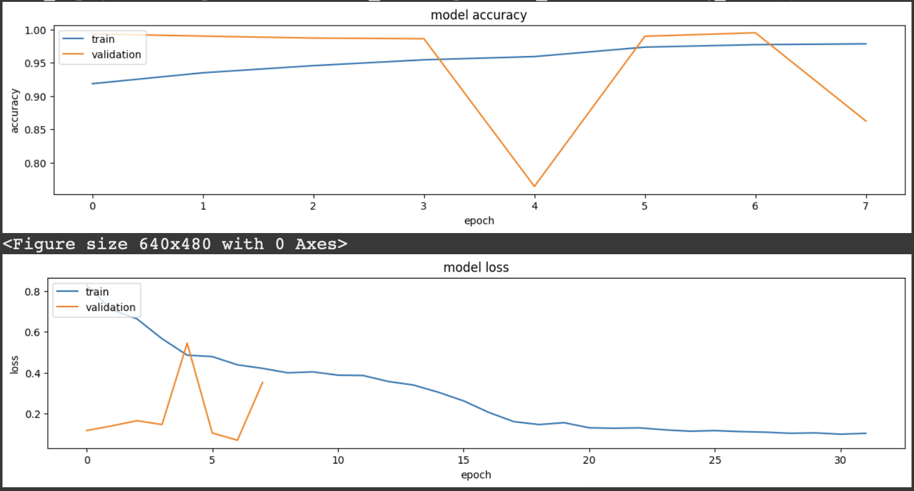 <em>1. lr = 0.1, epochs = 8, batch size = 8</em>

                  

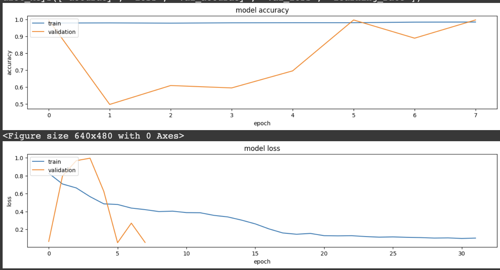 <em>lr = 0.01, epochs = 8, batch size = 8</em>

                   

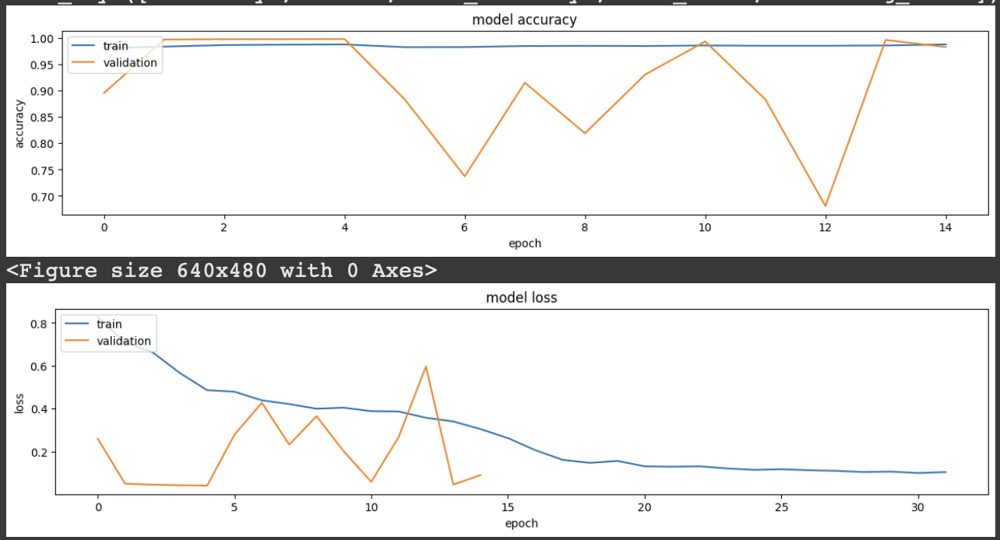 <em>3. lr = 0.01, epochs = 32, batch size = 8</em>

                 

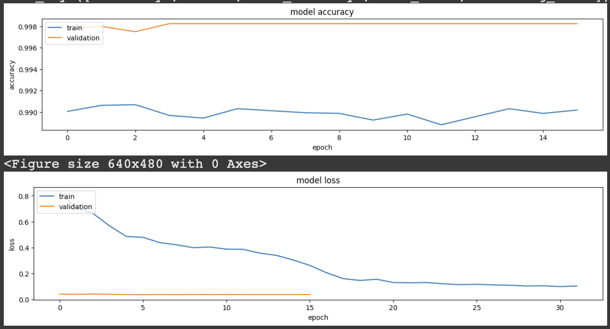 <em>4. lr = 0.01, epochs = 32, batch size = 32</em>

                 

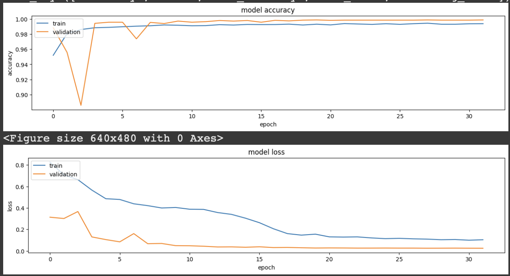 <em>5. lr = 0.001, epochs = 32, batch size = 32</em>

                   

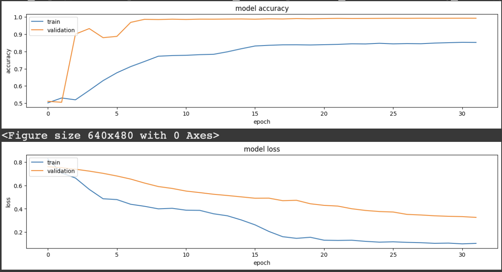 <em>6. lr = 0.00001, epochs = 32, batch size = 32</em>

         

üî∏ **Analysis:**

When the learning rate was set to 0.1 and both epoch and batch size were set to 8,
the validation accuracy and loss were unstable. This is mainly because the learning
rate is too high. Lowering the lr to 0.01 and increasing epoch and batch size increased the accuracy. Training loss
decreased but validation is still inconsistent. 

In the 4th trial, the graphs were stable and validation loss is low. both curves are almost flat
which indicates high accuracy.

In number 6, due to really low learning rate and not large enough epochs or batch size,
it resulted in underfitting even though the graphs are stable.

b) **Modify the model architecture by adding or removing layers:**

My model currently is underfitting (pic number 6), I will add one more Conv1D layer
to increase the validation accuracy. I will also increase the epochs and batch size.

  
            Conv1D(filters=6, kernel_size=3, padding='same'),
            Activation('relu'),
            MaxPooling1D(pool_size=2),
            Dropout(0.1),

üî∏ **result:**

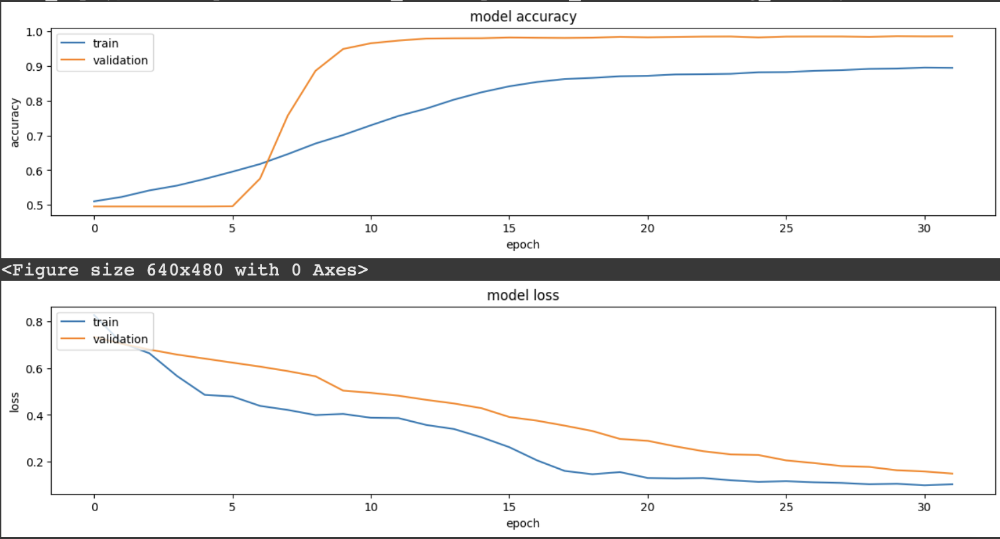

- skills: building 1D CNN, reading data from CSVs, Confusion Matrix, Accuracy, Loss Curves.

### July 8, 2025
- Researched Sparse Matrix Vector Multiplication
- Read Chapter 6 of Parallel Programming for FPGAs (The HLS Book)

Details: [SpMV](#Sparse-Matrix-Vector-Multiplication)

### July 9, 2025
- More research about SpMV 

Details: [SpMV](#Sparse-Matrix-Vector-Multiplication)

### July 10, 2025
- Find more research papers about SpMV
- Come up with Python codes for each SpMV compression format
- Compare algorithms by execution time and memory
- skills: new python libraries to calculate execution time, memory profiling,
comparing and plotting performance of algorithms

Details: [SpMV](#Sparse-Matrix-Vector-Multiplication)

### July 11, 2025
- Create comparative table with all te SpMV algorithms
- generate more test data for the algorithms
- Created slideshow to present on Monday

Details: [SpMV](#Sparse-Matrix-Vector-Multiplication)

---

# Sparse Matrix Vector Multiplication
**Definition:** SpMV is multiplying the non-zero elements of a sparse matrix by a dense vector.
Equation (1) is how SpMV is represented, A is the sparse matrix and x and y are dense vectors.

### `y = Ax`          (1)

Different compression formats to perform SpMV:
1) Compressed Sparse Row (CSR)[^1].
2) Compressed Sparse Column (CSC)[^2].
3) Coordinate (COO) Format[^2].
4) ELLPACK (ELL) Format [^2].
5) Sliced ELLPACK (SELL)[^3].

## 1) Compressed Sparse Row (CSR)

Represents a matrix using three arrays: 

**values[ ]:** Stores non-zero values of the matrix.

**columnIndex[ ]:** Stores column index of the non-zero elements.

**rowPtr[ ]:** Stores the starting indices in values[ ] for each row. Always starts from 0.
Its last value is equal to the number of non-zero elements in the matrix.

###### Sample Algorithm (Python):
    
    def spmv_csr(row_ptr, col_index, values, x):
        num_rows = len(row_ptr) - 1
        y = [0.0] * num_rows
        for i in range(num_rows):
            sum_val = 0
            for k in range(row_ptr[i], row_ptr[i + 1]):
                sum_val += values[k] * x[col_index[k]]
            y[i] = sum_val
        return y

## 2) Compressed Sparse Column (CSC)

Similar to CSR, represents a matrix by three arrays:

**values[ ]:** Non-zero elements in the matrix in column-major order.

**rowInd[ ]:** Stores the row index of the non-zero values.

**columnOffsets[ ]:** Stores the starting indices in values[ ] for each column. Always
starts from 0. The last value is equal to the number of non-zero elements in the matrix.

###### Sample Algorithm (Python):

    def spmv_csc(col_ptr, row_index, values, x):
        num_rows = max(row_index) + 1
        y = [0.0] * num_rows
        for j in range(len(col_ptr) - 1):
            for k in range(col_ptr[j], col_ptr[j + 1]):
                y[row_index[k]] += values[k] * x[j]
        return y

## 3) Coordinate (COO) Formate

Represented by three arrays: 

**values[ ]:** Non-zero elements in the matrix in row-major ordering.

**columnInd[ ]:** Holds the column indices of the non-zero elements of the matrix.

**rowInd[ ]:** Holds the row indices of the non-zero elements of the matrix.

###### Sample Algorithm (Python):

    def spmv_coo(row_index, col_index, values, x):
        num_rows = max(row_index) + 1
        y = [0.0] * num_rows
        for i in range(len(values)):
            y[row_index[i]] += values[i] * x[col_index[i]]
        return y

## 4) ELLPACK (ELL) Format

Creates two matrices from original sparse matrix: value matrix and column index.
The storage overhead of ELLPACK is determined by the _longest
row_, which is the maximum number of nonzero elements in
one row of the matrix

**Value Matrix:** Stores the values of the non-zero elements of the sparse matrix.

**Column Index:** Stores the column indices of each non-zero element of from the original matrix.

###### Sample Algorithm (Python):

    def spmv_ell(ell_values, ell_col_index, x):
        num_rows = len(ell_values)
        max_nnz = len(ell_values[0])
        y = [0.0] * num_rows
        for i in range(num_rows):
            for j in range(max_nnz):
                y[i] += ell_values[i][j] * x[ell_col_index[i][j]]
        return y

## 5) Sliced ELLPACK (SELL)

Instead of padding all rows in the whole matrix to match the global longest row like what's done in ELL, 
SELL splits the original matrix into blocks of rows (number defined by the user), each group is treated separately 
for better memory usage and faster execution time.

Elements in the slices are stored column by column.

The matrix is represented by three arrays:

**values[ ]:** Non-zero values and padding, stored in column-major order.

**columnInd[ ]:** Column index of each non-zero value in the matrix, or -1 for padding.

**sliceOffsets[ ]:** Starts from 0, holds where each slice starts in the columnInd[ ] array.

###### Sample Algorithm (Python):

    def spmv_sell(slice_height, slice_offsets, values, col_index, x):
        y = []
        offset = 0
        num_slices = len(slice_offsets)
        
        for slice_num in range(num_slices):
            rows_in_slice = min(slice_height, len(x) - slice_num * slice_height)
            cols_in_slice = (slice_offsets[slice_num] - offset) // rows_in_slice
            
            for i in range(rows_in_slice):
                sum_val = 0
                for j in range(cols_in_slice):
                    idx = offset + j * rows_in_slice + i
                    col = col_index[idx]
                    val = values[idx]
                    if col != -1:  # -1 padding
                        sum_val += val * x[col]
                y.append(sum_val)
            offset = slice_offsets[slice_num]
        
        return y

---
## Compare Methods: [Click for Full code](GhalaMore%2FSpMV_Algorithms.py)

**After running all the different algorithms on 4x4 matrix and 10x10 matrix. These are the results:**

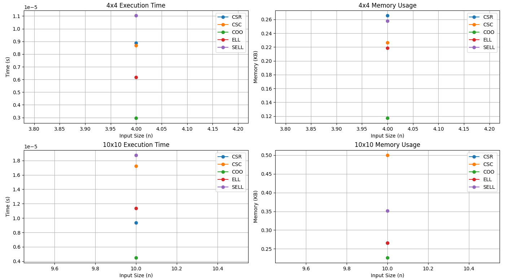

üî∏ **Results in a table:**
  
  | Format | Execution Time  (10-6seconds) | Memory Usage  (KB)                   | Best Used for                                                     | Disadvantages                                                                                 | Best platform |
  |--------|------------------------------------------|--------------------------------------|-------------------------------------------------------------------|-----------------------------------------------------------------------------------------------|---------------|
  | CSR    | (8, 9)                                   | (0.27, 0.27)                         | Frequent row access (Linear memory access)                        | Not efficient for matrices with highly uneven row sizes = Not uniform workload                | CPU & FPGA    |
  | CSC    | (8, 16)                                  | (0.23, 0.5)                          | Frequent column access                                            | multiple columns might  contribute to the same output row so not good for parallelization | CPU & FPGA    |
  | COO    | (3, 4) the least in both cases           | (0.12, 0.23) the least in both cases | Stores individual (row, col, val) entries directly = easy to edit | Random access due to (y[row_index[i]]) = poor cache, Slower for big data                      | FPGA          |
  | ELL    | (6, 11)                                  | (0.22, 0.27)                         | All rows same length = balanced load                              | Padding wastes memory                                                                         | GPU           |
  | SELL   | (11, 18) the most in both cases          | (0.26, 0.35)                         | Regular memory access = balanced load, Less padding than ELL      | Padding wastes memory                                                                         | GPU           |

---
[^1]: Kastner, R., Matai, J., & Neuendorffer, S. (2018). Chapter 6: Functional Verification and Optimization. 
In Parallel programming for FPGAs.

[^2]: Cretì, A. (2023). Efficient sparse matrix-vector multiplication on FPGA: A comparative study of memory-aware 
formats (Master’s thesis, Politecnico di Torino). Retrieved from https://webthesis.biblio.polito.it/26674/

[^3]: NVIDIA. (2023). cuSPARSE Library: Storage Formats — Sliced Ellpack (SELL). CUDA Toolkit Documentation 
v12.2.0. Retrieved from https://docs.nvidia.com/cuda/archive/12.2.0/cusparse/storage-formats.html

---

## Week 3
### June 30, 2025
- Completed 01-Basic_Exercises; Python exercises

### July 1, 2025
- Completed 02-Numpy_pandas_seaborn 
- Skills: Numpy, Pandas, Seaborn, matplotlib

### July 2, 2025

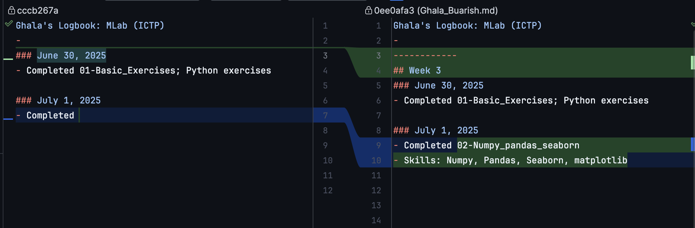

- Using the Git extension in PyCharm, I was able to access previous versions
of the repository. The picture above shows the difference made from the commit
a day before. The additions are highlighted in green, the deleted content in blue. 

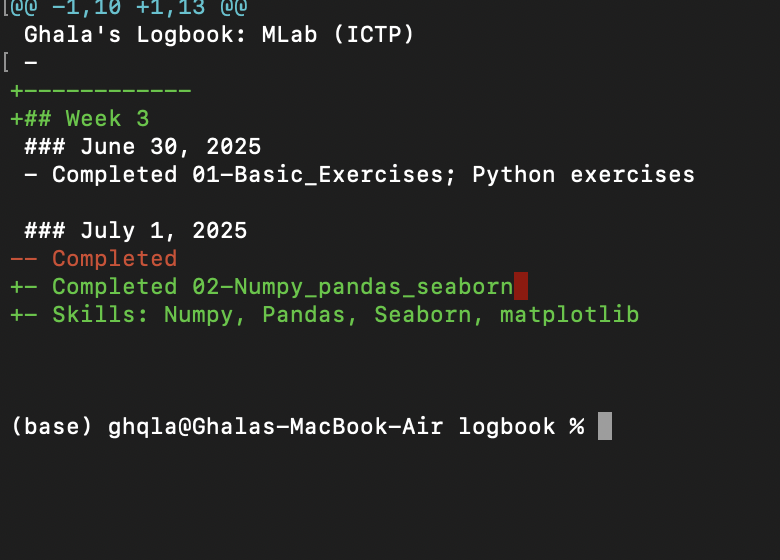

- Using the terminal, I did the same process as above, except I used the command 
Git diff instead of the extension. It showed me the differences between the
current version of the logbook and the last commit made. 

### July 3, 2025
## High-Level Synthesis Basics
### 1st Application: Matrix Multiplication

    
Solution 1:

Applied HLS Pipeline directive to the first loop.
Board used Zynq UltraScale+ZCU102 Evaluation Board. Clock of 10 ns applied.

| Applied Directive | Resources (BRAM, DSP, LUT, FF) | Latency | 
|-------------------|--------------------------------|---------|
| HLS Pipeline      | (0, 48, 1201, 962)             | 30      |

---

    
Solution 2:

Applied HLS Unroll directive to the first loop.
Maintained the board and clk from solution 1.

| Applied Directive | Resources (BRAM, DSP, LUT, FF) | Latency | 
|-------------------|--------------------------------|---------|
| HLS Unroll        | (0, 48, 1788, 600)             | 49      |

---

    
Solution 3:

Went back to Pipeline HLS directive to the first loop.
Applied Array_Partition to all inputs and outputs. Maintained the board and changed clk to 12ns. 

| Applied Directive   | Resources (BRAM, DSP, LUT, FF) | Latency | 
|---------------------|--------------------------------|---------|
| HLS Unroll          | (0, 48, 1546, 1426)            | 21      |
| HLS Array_partition |                                |         |

---

    
Solution 4:

Same as solution 3 but clk = 5 ns .

| Applied Directive   | Resources (BRAM, DSP, LUT, FF) | Latency | 
|---------------------|--------------------------------|---------|
| HLS Unroll          | (0, 48, 1651, 1782)            | 26      |
| HLS Array_partition |                                |         |

---

    
Solution 5:

Using same configuration as solution 4 but changing the part to 
xc7a35tcsg325-1

| Applied Directive   | Resources (BRAM, DSP, LUT, FF) | Latency | 
|---------------------|--------------------------------|---------|
| HLS Unroll          | (0, 48, 1351. 3398)            | 29      |
| HLS Array_partition |                                |         |

üî∏ **Analysis:**

When pipelining was compared to unroll without any further changes, 
HLS pipeline was found to be more time efficient.

When HLS Array_partition was introduced with pipeline, the latency cycles
decreased improving time efficiency. 

Decreasing the clock (5 ns) slightly increased the latency cycles but decreased
the overall latency time.

Changing the part to xc7a35tcsg325-1 was found to show less efficient results,
more time and more resources used.

Solution 4 shows the least amount of latency (ns) and Solution 1
used up the least amount of resources.
    
### **2nd Application: Vector Addition**

    
Solution 1:

clk set to 10 ns. Board Zynq UltraScale+ZCU102 Evaluation Board. Applying HLS Pipeline.

| Applied Directive | Resources (BRAM, DSP, LUT, FF) | Latency | 
|-------------------|--------------------------------|---------|
| Pipeline          | (0, 0, 125, 5)                 | 6       |

---

    
Solution 2:

Applying HLS Unroll instead of Pipeline.

| Applied Directive | Resources (BRAM, DSP, LUT, FF) | Latency | 
|-------------------|--------------------------------|---------|
| Unroll            | (0, 0, 98, 9)                  | 6       |

---

    
Solution 3:

Applying Array_partition to all inputs and outputs. 

| Applied Directive | Resources (BRAM, DSP, LUT, FF) | Latency | 
|-------------------|--------------------------------|---------|
| Unroll            | (0, 0, 125, 5)                 | 6       |
| Array_partition   |                                |         |

---

    
Solution 4:

Change clk to 12 ns

| Applied Directive | Resources (BRAM, DSP, LUT, FF) | Latency | 
|-------------------|--------------------------------|---------|
| Unroll            | (0, 0, 125, 5)                 | 6       |
| Array_partition   |                                |         |

---

    
Solution 5:

Change clk to 5 ns

| Applied Directive | Resources (BRAM, DSP, LUT, FF) | Latency | 
|-------------------|--------------------------------|---------|
| Unroll            | (0, 0, 125, 5)                 | 6       |
| Array_partition   |                                |         |

---

    
Solution 6:

Performing the synthesis with xc7a35tcsg325-1.

| Applied Directive | Resources (BRAM, DSP, LUT, FF) | Latency | 
|-------------------|--------------------------------|---------|
| Unroll            | (0, 0, 133, 72)                | 6       |
| Array_partition   |                                |         |

---
üî∏ **Analysis:**

Comparing Unroll to Pipeline, Unroll seems to do just as good as Pipeline but with less
resources.

Using Array_partition did not make the latency decrease and used up more resources.

increasing the clock didn't change the amount of latency cycle however this means that it 
has an overall greater latency time.

Decreasing the clock decreased the latency time. 

Changing the board used to xc7a35tcsg325-1, did not do any changes except for using up 
more resources. 

Overall, solution 5 is the most efficient but maybe with deleting the Array_Partition.

---
- skills : Vitis HLS, C++, optimization techniques (unroll, pipeline, array partition)

---

## Week 2
- Learning Vivado
- Using comblock; Lab 02 Vivado
- 01 Tutorial on Jupyter; configuring basic cluster
- 02 Tutorial on Jupyter; cluster interaction 
- 03 Tutorial on Jupyter; Replicating Lab 02 Vivado with HyperFPGA
- Interacting with cluster using Python

---

## Week 1
- Introduction to research projects
- Touring ICTP
- Getting Started with SoC-FPGA; Lab 01 Vivado

---
# Full Tutorial: How to Deploy any SpMV Method on FPGA

---
### [Flowchart](#-flowchart)

- [Phase 1: Validate Format](#-phase-1-validate-format-)
  - Why FPGAs?
- [Phase 2: Performance on FPGA](#-phase-2-performance-on-fpga)
  - HyperFPGA Cluster at ICTP
  - Problems you may run into: HLS constraints
- [Phase 3: HLS Development](#-phase-3-hls-development)
  - HLS optimization Directives
- [Phase 4: Vivado](#-phase-4-vivado)
  - Problem I ran into: loops not using FIFO ready signal
- [Phase 5: Host FPGA Interface](#-phase-5-host-fpga-interface)
  - Possible errors

---
### üî∏ Flowchart:

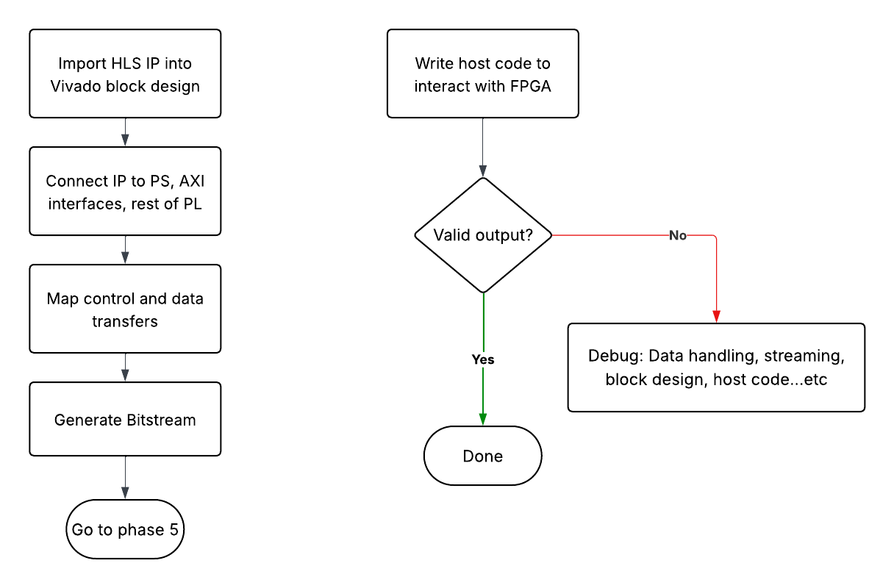

### üî∏ Phase 1: Validate Format 

**Choose Format:** Sparse matrices are typically encoded in condensed formats that only contain the non-zero elements
in order to restrict the data collection needed. Depending on the matrix's characteristics, choose the best compression format. Some matrix 
characteristics to help decide which format is best to use: row length variation, memory footprint, sparsity pattern (if there is a pattern), 
matrix size. Find a brief explanation of the five most common sparse matrix compression formats [here](#sparse-matrix-vector-multiplication).
Important information to keep in mind is your target architecture (e.g. FPGA, CPU/GPU). 

⭐ **Why FPGAs?:** SpMV involves accessing non-sequential memory locations because of sparse nature of matrices.
This irregular memory access pattern can lead to cache misses, causing increased memory latency and
affecting the overall performance of both CPUs and GPUs. Additionally, the workload in SpMV is not
evenly distributed among the processing elements. This load imbalance can lead to inefficient resources usage, especially on GPUs 
where parallelism is crucial. For those reasons, CPUs and GPUs may not be the most suitable platforms for accelerating SpMV.
 FPGAs are used in this case for their tailored logical components and efficient computation reducing latency and providing immediate feedback. 
But there are constraints.

**FPGA Friendly Format?:** to leverage the advantages of FPGAs we are looking for predictable memory access (e.g. CSR, CSC, ELL). 
In contrast, formats with random access like COO would not leverage the parallelism and would use up a lot of memory.

**Implement in Python:** code your format in any local compiler, check for criterias that concern you (e.g. time, memory, does this format
scale well...etc.) 

### üî∏ Phase 2: Performance on FPGA

**Connect to an FPGA Server:** In my project I connected to a remote computing environment provided by the Multidisciplinary Laboratory
(MLAB) at ICTP. I chose one node to connect to _hyperfpga-3be11_.

⭐ **HyperFPGA Cluster at ICTP:** Computing environment with 16 nodes, each equipped with a Zynq UltraScale+ MPSoC FPGA. 
ICTP created a pre-configured terminal interface designed for HLS development and FPGA deployment. The system provides pre-installed tools: 
Vitis HLS, Vivado, Python libraries for FPGA interface.

**Test Format on the Server:** time to execute the algorithm and memory usage may differ than the results you got when the algorithm is ran 
locally. **Suggestions:** 
- Run the algorithm on several matrices with different sizes to see if the format scales well.
- Measure execution time and data transmission time seperately to know what to look for in optimization.
- Measure memory usage to see if it exceeds the node's memory.
- Graph the results using your preferred python libraries (e.g. Seaborn, matplotlib) for easier analysis.

### ⭐ Problems you may run into:
**HLS Constraints:** Make sure the algorithm does not use any recursive functions since they cannot be synthesized. Additionally, do not use any STLs
because many STLs contain recursion and use dynamic memory allocation which cannot be synthesized by Vitis HLS. Virtual function and pointer are also
not supported. 

**Dynamic Memory Usage in HLS:** do not use any system call that is created at runtime (e.g. free(), alloc()). 

- You could also face this same issue when using `#pragma HLS unroll` if the rows aren't the same lengths because to unroll a loop completely, the loop
bounds must be known at compile time and when the lengths of the rows are unbalanced HLS gives an error because each loop bounds would need to be known at runtime.
- **Solution:** specify a factor N for the unroll directives. This way HLS would repeat the same amount of unrolling for each row.

### üî∏ Phase 3: HLS Development

After converting code to C, use **HLS optimization Directives**. Some of those directives are:

|                 |                                                                                                                | 
|-----------------|----------------------------------------------------------------------------------------------------------------|
| Pipeline        | Reduces the initiation interval by allowing the concurrent execution of operations within a loop or function   |       
| Array_partition | Partitions large arrays into multiple smaller arrays or into individual registers                              |   
| Unroll          | Unroll for-loops to create multiple independent operations ather than a single collection of operations        |
| Dataflow        | Enables task level pipelining, allowing functions and loops to execute concurrently. Used to minimize interval |

- **Challenge:** error when using some directives due to co-dependency. In matrix multiplication one loop iteration could depend on the result of a previous
iteration in some compression formats. This prevents parallel execution and gives error especially when using pipeline or unroll.
- **Suggestion:** try pipelining inner loop only and apply unroll with a factor N if needed.

**Testbench:** test your design with the testbench and compare the output with the expected result.

**Add HLS Streaming Interface:** [This is a useful link](https://docs.amd.com/r/en-US/ug1399-vitis-hls/Interfaces-of-the-HLS-Design)

**Synthesize to IP:** when you're satisfied with the time and resources optimization, generate IP core.

### üî∏ Phase 4: Vivado

In Vivado, create a project and choose the FPGA chip to use as a platform for the design. In my design I used Zynq MPSoC.
Then add the needed IP blocks:
- **Zynq PS**: enables software to control the FPGA logic, provides system clocks and reset signals.
- **Your custom HLS IP:** receives input data, performs computation, sends output.
- **AXI Interconnects:** programmable switch fabric that routes AXI transactions between masters (e.g. Zynq PS) and slaves (e.g. your IP, FIFO)
- **Comblock:** high-speed data transfer between the FPGA and an external system (e.g. host PC)

Make sure to run block automation which automatically configures clocks, resets, Axi ports.

⭐ **Problem I ran into:** I used the lines `#pragma HLS PIPELINE off` which stalls the hardware clock by not moving to the next iteration until the previous one is done and doesn't handle streaming 
  delays or FIFOs which causes shift of data and reads whatever data is next even if FIFO is not ready yet, which causes race condition. By deleting `#pragma HLS PIPELINE off` it 
  allows to start a new loop iteration each clock cycle as long as data is ready. It uses The FIFOs' TREADY and TVALID instead of directly reading whatever is next. Each `in_fifo.read()` waits 
  until the FIFO has valid data.

---

> [!CAUTION]
> Be careful when using `#pragma HLS PIPELINE off`.

**Generate Bitstream:** This is the final output of the design. It contains hardware instructions to configure the FPGA which will be 
uploaded to the FPGA node.

### üî∏ Phase 5: Host FPGA Interface

Connect to the same FPGA node and load the hardware exported from Vivado. Send test data into the FPGA then compare expected result with output.
This is where you would spot any mismatches and start the debugging process depending on the error.

⭐ **Possible errors:**
- **Output is all zeros or garbage:** FPGA might have not started computation, or possibly wrong register address.
Check that you wrote to the start register, confirm bitstream is loaded. 
- **Output is shifted:** Might be an issue with the timing, make sure the design in HLS actually uses the start and ready signals. lines like 
`#pragma HLS PIPELINE off` could prevent using those needed signals for the clock cycle. Check your indexing in Python.
- **No output:** input data might be not going through. Check input size sent and how many elements in fifo are returned. 
- **Output alternated between two results:** possibly computation starts before new inputs fully arrive, make sure the ready and start signals are used correctly.

---

## Example: Implement SpMV using ELLPACK in HLS

üî∏ **Convert Python to C**

###### Python:
    def spmv_ell(ell_values, ell_col_index, x):
        num_rows = len(ell_values)
        max_nnz = len(ell_values[0])
        y = [0.0] * num_rows
        for i in range(num_rows):
            for j in range(max_nnz):
                y[i] += ell_values[i][j] * x[ell_col_index[i][j]]
        return y

###### C (inputs concat into one vector):
    void spmv_ell(DTYPE data_in[TOTAL], DTYPE y[ROWS]) {
        DTYPE ell_values[ROWS][MAX_NNZ];
        int ell_col_index[ROWS][MAX_NNZ];
        DTYPE x[ROWS];
    
        int currInd = 0;
        for (int i = 0; i < ROWS; i++) {
            for (int j = 0; j < MAX_NNZ; j++) {
                ell_values[i][j] = data_in[currInd++];
            }
        }
        for (int i = 0; i < ROWS; i++) {
            for (int j = 0; j < MAX_NNZ; j++) {
                ell_col_index[i][j] = (int)data_in[currInd++];
            }
        }
        for (int i = 0; i < ROWS; i++) {
            x[i] = data_in[currInd++];
        }
        for (int i = 0; i < ROWS; i++) {
            y[i] = 0;
            for (int j = 0; j < MAX_NNZ; j++) {
                int col = ell_col_index[i][j];
                if (col != -1) {
                    y[i] += ell_values[i][j] * x[col];
                }
            }
        }
    }

üî∏ **HLS streaming**

- Implement AXI Streaming interfaces in HLS 

`#include <hls_stream> ` To define hls::stream operations

`hls::stream<TYPE> inputs;`
`hls::stream<TYPE> outputs;` to declare FIFO streams to be able to `.read() `and `.write()` to these
elements later on

`#pragma HLS INTERFACE axis port = your FIFOs` to synthesize ports as AXI stream interface

`#pragma HLS INTERFACE mode=ap_ctrl_hs port=return` handshaking control: IP won't start until all inputs are ready and won't 
finish until function is done. Adds ap_start, ap_done, ap_idel, ap_ready signals to IP.

Example in my code:

    void spmv_ell(hls::stream<float> &in_fifo, hls::stream<float> &out_fifo) {
    #pragma HLS INTERFACE axis port=in_fifo
    #pragma HLS INTERFACE axis port=out_fifo
    #pragma HLS INTERFACE mode=ap_ctrl_hs port=return

        DTYPE ell_values[ROWS][MAX_NNZ];
        int ell_col_index[ROWS][MAX_NNZ];
        DTYPE x[ROWS];

        for (int i = 0; i < ROWS; i++) {
            for (int j = 0; j < MAX_NNZ; j++) {
                ell_values[i][j] = in_fifo.read();
            }
        }
        for (int i = 0; i < ROWS; i++) {
            for (int j = 0; j < MAX_NNZ; j++) {
                ell_col_index[i][j] = (int)in_fifo.read();
            }
        }
        for (int i = 0; i < ROWS; i++) {
            x[i] = in_fifo.read();
        }
        for (int i = 0; i < ROWS; i++) {
            DTYPE y0 = 0;
            for (int j = 0; j < MAX_NNZ; j++) {
                int col = ell_col_index[i][j];
                if (col != -1) {
                    y0 += ell_values[i][j] * x[col];
                }
            }
            out_fifo.write(y0)
        }
    }

**Synthesis without any directives:**

| Module   | Directives | DSP | FF   | LUT  | Time     |
|----------|------------|-----|------|------|----------|
| spmv_ell | -          | 15  | 2129 | 2758 | 6.543 ns | 

Since the data we are testing the algorithm on is small, directives would not help with optimization.

üî∏ **Export RTL:** Vivado IP

üî∏ **Create Vivado Project:**
- Choose board for your project: _HyperFPGA 3be11_
- Add your custom IP core: Setting -> IP -> Repository -> add IP folder
- Create Block Design:
  - Add Zynq UltraScale+ MPSoC, Comblock, IP core
  - Comblock: 
    - Enable FIFOs input & output, data width = 32
    - Disable RAM, Enable Registers
  - Run Block Automation, Run Connection Automation
- Connect IP core to other components:
  - ap_clk to clocks
  - ap_rst_n to resets
  - ap_start to reg0_o
  - out_fifo_TREADY to constant 1
  - out_fifo_TDATA to comblock's fifo_data_i, _and vice versa_
  - out_fifo_TVALID to comblock's write enable
  - in_fifo_TVALID to comblock's fifo_valid_o
  - in_fifo_TREADY to comblock's read enable

üî∏**Finalize Design:**
- Validate Design, make sure there are no errors
- Generate Output Products, make sure the synthesis is Global
- Create HDL Wrapper
- Generate Bitstream: it will launch synthesis and implementation then generates bitstream
- Export hardware: Include Bitstream in Output
- Name convention: `<project name>-<FPGA model>.<xsa>`

üî∏ **Block Design:**

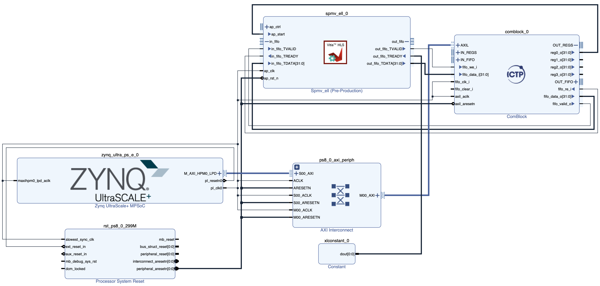

üî∏ **Host FPGA Interface on Jupyter Notebook:**
- On the preconfigured HyperFPGA server by ICTP, send data to the FPGA and read the output

**Example:**

    @dview.remote(block=True)
    def run_spmv(data_in):
        cb.fifo_out_clear()
        cb.fifo_in_clear()

        cb.write_reg(0, 1)
        for val in data_in:
            cb.write_fifo(val) 

        result = cb.read_fifo(cb.fifo_in_elements())

        cb.write_reg(0, 0)
        return result 
    
    print(run_spmv(data_in))

- **Current Output:** `ERROR`
- **Expected Output:** `[11,37,15,32]`
- **Possible Error:** -1 cannot be passed into the FPGA

üî∏ **Debug**
- Go back to HLS and change the type of the variable taking in `-1` to ap_int<32> and check for 4294967295 instead of -1 
directly. Update IP in Vivado and run it again on the server. In the server in Python, make sure to replace -1's with the 
32-bits representation (4294967295).

---
## üî∏ Scale Design to Larger Matrices

For SpMV hardware implementation on larger matrix sizes, a hardware constraint is FIFO buffer overflow. In my previous designs
the `out_fifo_ready` signal was kept always high. Since FIFO is going to receive more data than it can hold at once, it would cause
shift in the data, and we would end up with the wrong output data.

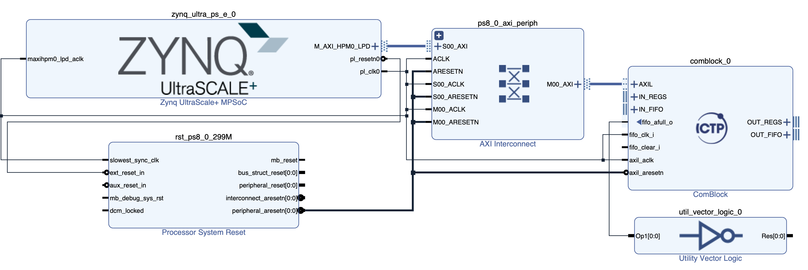 

### New Flow-Control Technique:

Use `fifo_almost_ready` signal: goes high when the FIFO is almost full, allowing the system to take action before overflow.

**Base connections:**

* `out_fifo_ready = 0` (Not ready to send data).
* `out_fifo_ready = 1` (send data).

---

# Comparing 3 Different Compression Formats Used for SpMV (CSR, ELL, COO)

- [4x4 Matrix](#algorithms-tested-on-4x4-matrix)
- [256x256 Matrix](#algorithms-tested-on-256x256-matrix)
- [512x512 Matrix](#algorithms-tested-on-512x512-matrix)

## Algorithms Tested on 4x4 Matrix:
üî∏ **HLS Synthesis**

| Module  | Directives                                                                                      | DSP | FF  | LUT | BRAM | Latency (ns) |
|---------|-------------------------------------------------------------------------------------------------|-----|-----|-----|------|--------------|
| **CSR** | Unroll inner loop of computation                                                                | 3   | 589 | 648 | 0    | 230          | 
| **ELL** | Array Partition (ell_values, ell_cols) dim=2, (x) dim=1. Pipline II=2 inner loop of computation | 3   | 454 | 412 | 0    | 360          |
| **COO** | No directives help to optimize                                                                  | 3   | 826 | 919 | 0    | 440          |

üî∏ **Post-Implementation** _(Vivado)_

| Module  | DSP | FF   | LUT  | BRAM | On-Chip Power (W) |
|---------|-----|------|------|------|-------------------|
| **CSR** | 3   | 1447 | 1046 | 2    | 3.245             | 
| **ELL** | 3   | 1299 | 882  | 2    | 3.244             |
| **COO** | 3   | 1684 | 1230 | 2    | 3.245             |

üî∏**Performance on FPGA**

| Module  | Computation Time (s) | Transmission Time (s) | Memory (KB) |
|---------|----------------------|-----------------------|-------------|
| **CSR** | 0.022978             | 0.000734              | 40.368164   | 
| **ELL** | 0.022092             | 0.000387              | 40.606445   |
| **COO** | 0.02912              | 0.000864              | 41.419922   |

## Algorithms Tested on 256x256 Matrix:
üî∏ **HLS Synthesis**

| Module  | Directives                                                                                      | DSP | FF   | LUT  | BRAM | Latency (ns) |
|---------|-------------------------------------------------------------------------------------------------|-----|------|------|------|--------------|
| **CSR** | Unroll inner loop of computation                                                                | 3   | 351  | 778  | 39   | 267170       | 
| **ELL** | Array Partition (ell_values, ell_cols) dim=2, (x) dim=1. Pipline II=2 inner loop of computation | 3   | 8389 | 6469 | 104  | 535000       |
| **COO** | No directives help to optimize                                                                  | 3   | 318  | 1089 | 69   | 530000       |

üî∏ **Post-Implementation** _(Vivado)_

| Module  | DSP | FF   | LUT  | BRAM | On-Chip Power (W) |
|---------|-----|------|------|------|-------------------|
| **CSR** | 3   | 1299 | 1059 | 21   | 3.253             | 
| **ELL** | 3   | 9375 | 4772 | 54   | 3.364             |
| **COO** | 3   | 1332 | 1524 | 34   | 3.255             |

üî∏**Performance on FPGA**

| Module  | Computation Time (s) | Transmission Time (s) | Memory (KB) |
|---------|----------------------|-----------------------|-------------|
| **CSR** | 1.684624             | 0.000915              | 3567.058594 | 
| **ELL** | 1.128844             | 0.00099               | 93.975586   |
| **COO** | 2.103683             | 0.001274              | 3539.96875  |

 
## Algorithms Tested on 512x512 Matrix:
üî∏ **HLS Synthesis**

| Module  | Directives                                                                                      | DSP | FF    | LUT   | BRAM | Latency (ns) |
|---------|-------------------------------------------------------------------------------------------------|-----|-------|-------|------|--------------|
| **CSR** | Unroll inner loop of computation                                                                | 3   | 359   | 787   | 125  | 1058290      | 
| **ELL** | Array Partition (ell_values, ell_cols) dim=2, (x) dim=1. Pipline II=2 inner loop of computation | 3   | 16597 | 12090 | 206  | 2115000      |
| **COO** | No directives help to optimize                                                                  | 3   | 333   | 1103  | 223  | 2108000      |

üî∏ **Post-Implementation** _(Vivado)_

| Module  | DSP | FF    | LUT  | BRAM | On-Chip Power (W) |
|---------|-----|-------|------|------|-------------------|
| **CSR** | 3   | 1311  | 1613 | 64.5 | 3.269             | 
| **ELL** | 3   | 17577 | 7494 | 105  | 3.457             |
| **COO** | 3   | 1382  | 2062 | 128  | 3.287             |

üî∏**Performance on FPGA**

| Module  | Computation Time (s) | Transmission Time (s) | Memory (KB)  |
|---------|----------------------|-----------------------|--------------|
| **CSR** | 5.838851             | 0.002164              | 10156.064453 | 
| **ELL** | 4.351161             | 0.000877              | 351.314453   |
| **COO** | 7.971703             | 0.002147              | 10769.614258 |

# Distributed Computing SpMV using CSR, ELL, and COO

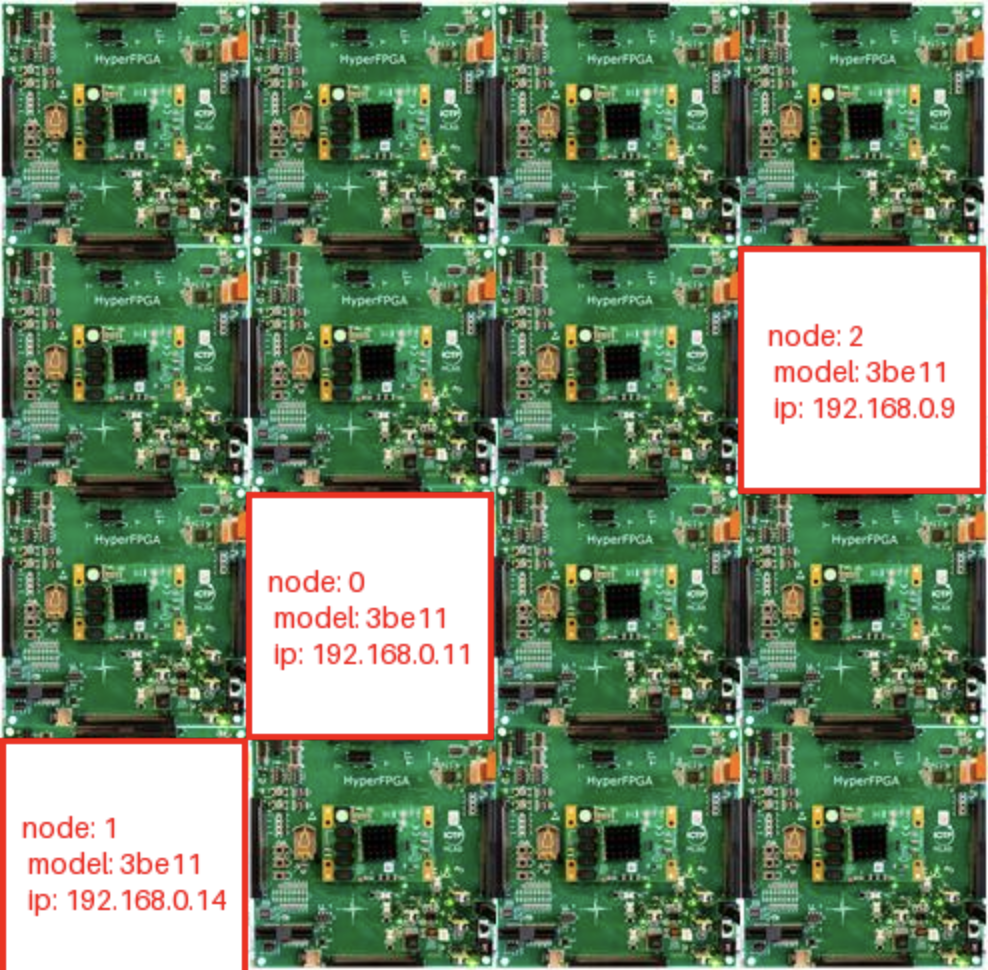 

> Using the HyperFPGA Cluster, I ran SpMV using three different methods ([CSR](#1-compressed-sparse-row-csr), 
> [ELL](#4-ellpack-ell-format), [COO](#3-coordinate-coo-formate)) at the same on 3 different nodes in
the cluster. I tested the clusters on the maximum value that can be loaded into the FPGA using those methods, then compared
> the computation time, data transmission time, and memory usage. 

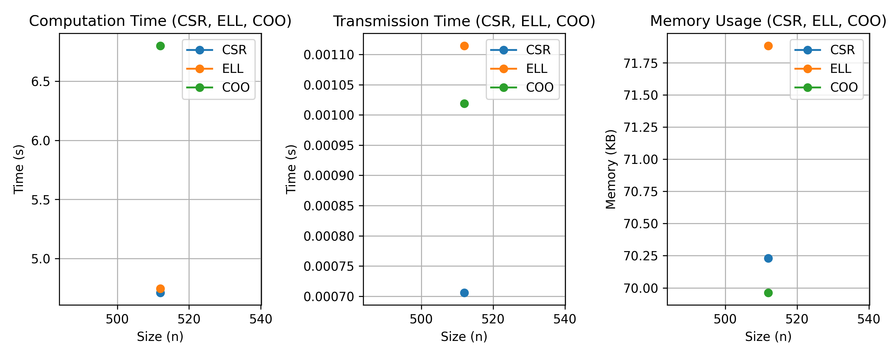

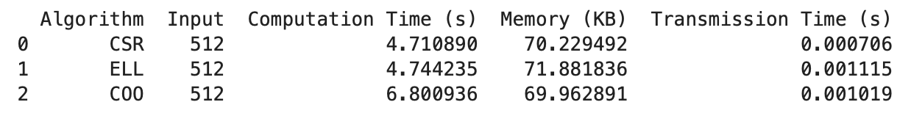

